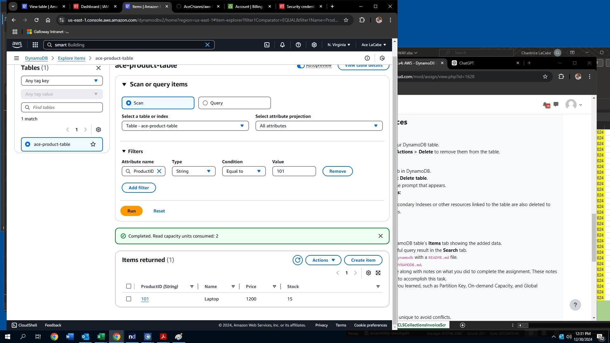
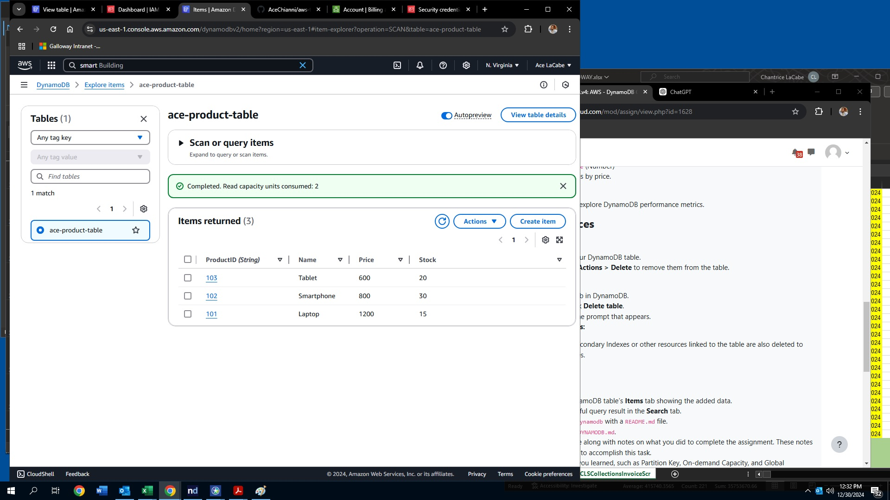

# How to Use DynamoDB - Assignment

## Steps Followed to Complete the Assignment

### Step 1: Create a DynamoDB Table
1. In the AWS Console, navigate to DynamoDB and click on **Create table**.
2. Table name: `ace-product-table`.
3. Partition Key: `ProductID` (String).
4. **On-demand capacity mode** was selected to avoid managing read/write capacity manually.
5. Click **Create table**.

### Step 2: Add Items to the Table
1. After the table is created, go to the **Items** tab and click **Create item**.
2. Using the JSON editor, I added the following items:
   ```json
   {
     "ProductID": "101",
     "Name": "Laptop",
     "Price": 1200,
     "Stock": 15
   }
3. Repeated process with following details:
{
     "ProductID": "102",
     "Name": "Smartphone",
     "Price": 800,
     "Stock": 30
   }

   {
     "ProductID": "103",
     "Name": "Tablet",
     "Price": 500,
     "Stock": 20
   }

### Step 3: Query Data from the Table
1. In the **Items** tab, click on **Search**.
2. Under the **Partition key**, enter a `ProductID` value (e.g., `101`) and click **Run**.
3. The item corresponding to `ProductID 101` ("Laptop") is displayed in the query results.
   
   Example Query Result:
   ```json
   {
     "ProductID": "101",
     "Name": "Laptop",
     "Price": 1200,
     "Stock": 15
   }
4. Verify that the correct item is returned for the ProductID value entered.

### Step 4: Scan All Items
1. In the **Items** tab, click on **Scan**.
2. All the items added to the table (Laptop, Smartphone, Tablet) will be visible in the results.
   
   Example Scan Results:
   ```json
   [
     {
       "ProductID": "101",
       "Name": "Laptop",
       "Price": 1200,
       "Stock": 15
     },
     {
       "ProductID": "102",
       "Name": "Smartphone",
       "Price": 800,
       "Stock": 30
     },
     {
       "ProductID": "103",
       "Name": "Tablet",
       "Price": 500,
       "Stock": 20
     }
   ]
3. Ensure all the items added are visible in the scan results.

- **Query Results:**
  

- **Scan Results:**
  